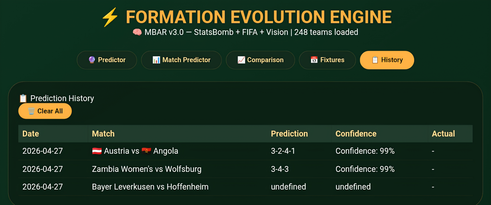

# ⚽ Formation Evolution Engine

**A fully offline, AI‑powered football formation predictor and team analyzer running entirely on your Android phone (Termux).**

Built with:
- **🟩 StatsBomb Open Data** (real match events)
- **🧠 MBAR v3.0** (6‑layer residual attention + GBDT‑128 + Monte Carlo)
- **⭐ FIFA 23 Player Dataset** (60+ team attributes)
- **📊 DataHub League Stats** (match outcomes, cards, corners)
- **🌍 OpenFootball World Cup** (tournament records)
- **🎯 Free live fixtures** via football‑data.org API

---

## 🚀 Features

| Tab | What it does |
|---|---|
| 🔮 **Predictor** | Predicts the most likely formation for any two teams, displays FIFA‑style attribute card, tactical vision (Gegenpressing, Tiki‑Taka, …), and saves predictions to history |
| 📊 **Match Predictor** | Win/draw/loss percentages and expected goals based on team strengths |
| 📈 **Comparison** | Head‑to‑head bar charts + shared radar chart of key stats |
| 📅 **Fixtures** | Real upcoming matches (auto‑refreshed every hour) or manually add custom matches |
| 📋 **History** | All saved predictions, stored locally in your browser |

All dropdown menus are searchable, **grouped by league → country**, and display **national flags** for international teams.

## 📸 Screenshots

| Predictor | Match Predictor | Comparison | Fixtures | History | FIFA Card |
|-----------|----------------|------------|----------|---------|-----------|
|  |  |  |  |  |  |

---
## 🔧 Installation (Termux on Android)

### 1. Install Termux & basic packages
```bash
pkg update && pkg upgrade
pkg install python python-numpy python-pandas python-lxml python-scipy
pip install statsbombpy
